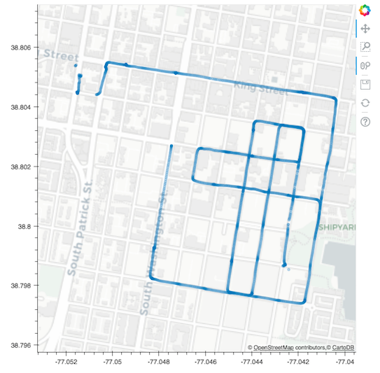

# gomap

Some utilities for working with gopro data


## Requirements

Tested under Python 3.6 with `numpy`, `pandas`, `pillow`, `pyproj`, and
`bokeh`. You can recreate my environment using:

```{bash}
conda env create -f environment.yml
```

Activate the environment with

```{bash}
. activate gomap
```

# CLI

At the moment `gomap` has two command-line scripts for managing GoPro images.
Run either with `-h` from the console to pull up help information.

## `prune.py`

Remove image files that were taken within some threshold distance of each other.

### Usage

Just pass it the directory to be scanned:

```{python}
python prune.py /path/to/image/dir1
```
Default threshold is 2 meters. If the files are split in multiple folders,
you can pass it the top-level directory and it will search all subdirectories.

You can also set the distance threshold (in meters) for pruning:

```{python}
python prune.py /path/to/DCIM/ --thresh 5
```

## `map.py`



Map out the locations where images have been taken. 

### Usage

Just like `prune.py`, pass the directory (or top-level directory) containing
images:

```{python}
python map.py /path/to/DCIM/
```
